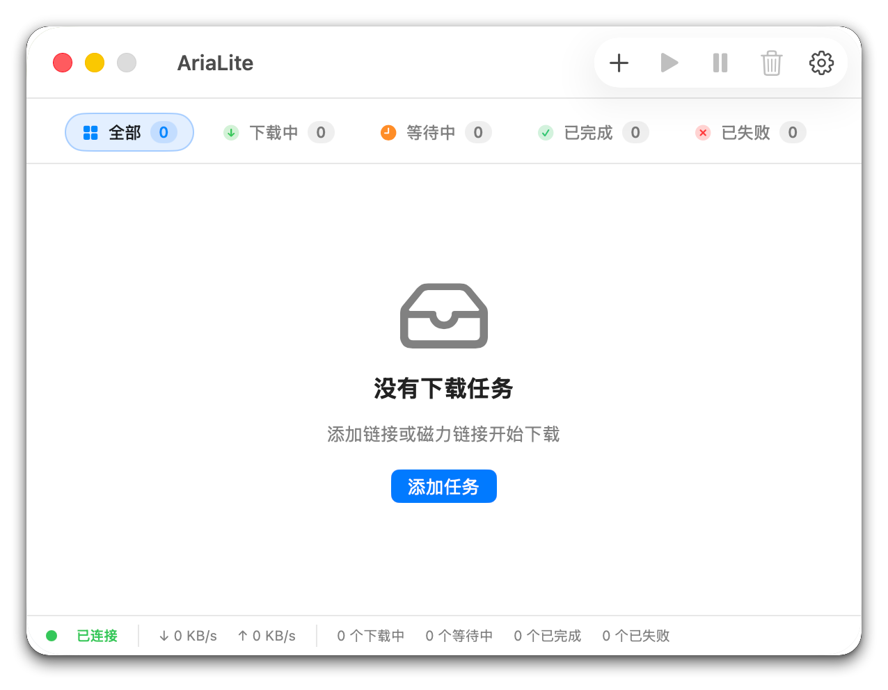

# AriaLite

<p align="center">
  
</p>

<p align="center">
  
</p>

[中文](#中文) | [English](#english)

## 中文

[AriaFlow](https://github.com/FateLightX/AriaFlow) 的轻量 macOS 下载客户端：URL / magnet、内嵌 aria2-next、菜单栏速度、可配置远程 RPC。

- 队列：添加、暂停/继续、删除、Finder 显示、复制链接
- 顶部彩色筛选、搜索、排序；菜单栏速度
- 内嵌 Aria2 Next 2.5.1（Apple Silicon + Intel）
- 可配置 RPC 地址 / 端口 / Secret（本机启引擎，远程只连 RPC）
- 固定主窗口 600×400；无 Torrent 选择、历史、Blocklist、Dock 进度

**要求：** macOS 14+（macOS 26 启用 Liquid Glass）；源码构建需 Xcode 26 / Swift 6.2。

**安装：** 从 [Releases](https://github.com/FateLightX/AriaLite/releases) 下载 ZIP 与 `.sha256`。ad-hoc 签名、未公证；Gatekeeper 拦截时 Control-点击 `AriaLite.app` → 打开。

```bash
export DEVELOPER_DIR=/Applications/Xcode.app/Contents/Developer
swift build --disable-sandbox
scripts/package_app.sh
scripts/verify_release.sh
```

产物：`dist/AriaLite.app`、`dist/AriaLite-<version>.zip` 及校验文件。

| | AriaFlow | AriaLite |
|---|---|---|
| 协议 | HTTP/FTP/Magnet/ED2K/BT | HTTP/FTP/Magnet |
| 布局 | 侧边栏 | 顶部筛选栏 |
| 远程 RPC | 固定本机 | 可配置 `rpcHost` |
| 历史 / Blocklist / Dock | 有 | 无 |
| 主窗口 | 可缩放 | 固定 600×400 |

## English

Lightweight macOS download client from [AriaFlow](https://github.com/FateLightX/AriaFlow): URL/magnet, bundled aria2-next, menu bar speed, configurable remote RPC.

- Queue: add, pause/resume, delete, Reveal in Finder, copy link
- Colorful top filters, search, sort; menu bar speed
- Aria2 Next 2.5.1 (Apple Silicon + Intel)
- Configurable RPC host / port / secret (remote is connect-only)
- Fixed 600×400 window; no torrent picker, history, blocklist, or Dock progress

**Requirements:** macOS 14+; Xcode 26 / Swift 6.2 to build.

**Install:** Download from [Releases](https://github.com/FateLightX/AriaLite/releases). Ad-hoc signed, not notarized; Control-click → Open if Gatekeeper blocks.

```bash
export DEVELOPER_DIR=/Applications/Xcode.app/Contents/Developer
scripts/verify_release.sh
```

## Docs

[Architecture](docs/ARCHITECTURE.md) · [Sidecar](docs/SIDECAR.md) · [Release checklist](docs/RELEASE_CHECKLIST.md) · [Changelog](CHANGELOG.md) · [AGENTS.md](AGENTS.md) · [Third-party notices](THIRD_PARTY_NOTICES.md)

## License

AriaLite is [MIT](LICENSE). Bundled `aria2-next` is GPL-2.0; see [THIRD_PARTY_NOTICES.md](THIRD_PARTY_NOTICES.md).
